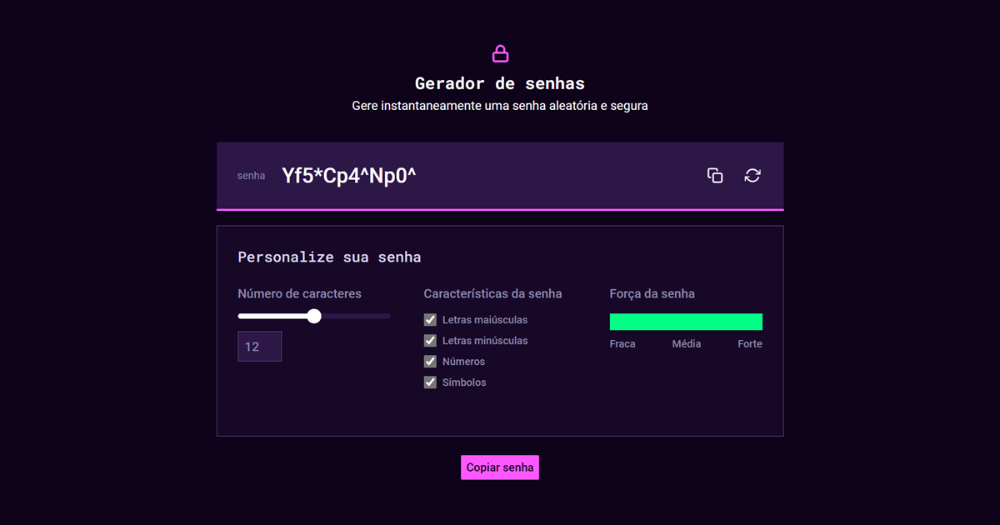
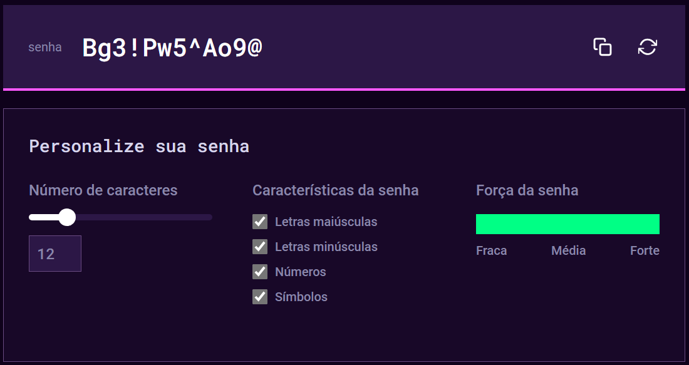
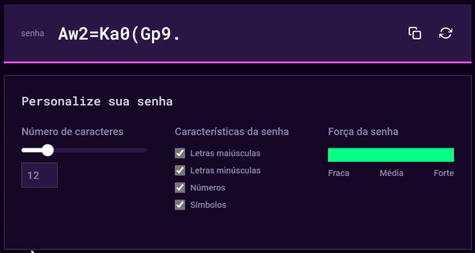
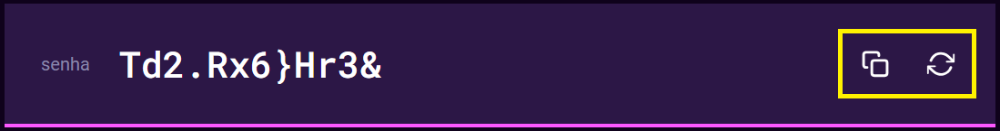

# Gerador de Senhas

Este **Gerador de Senhas** é uma aplicação desenvolvida como teste técnico para a posição de Pessoa Desenvolvedora Front End (Vaga Afirmativa para Mulheres) na [Alura](https://www.alura.com.br).

Nesta fase do processo seletivo, o objetivo é conhecer um pouco melhor a forma que o desenvolvedor trabalha e, para isso, a empresa selecionou 4 (quatro) _cases_ situações que são bem comuns no dia a dia de seus times, ficando à critério do desenvolvedor a escolha do projeto a ser desenvolvido.

<!-- prettier-ignore -->
|  |  |
| - | - |
| ✨ Nome       | **Gerador de senhas** |
| 🏷️ Tecnologias | JavaScript, HTML, Sass, CSS |
| 🚀 Live site         | **https://password-generator-angela.vercel.app/** |

  
  
  
  

## 📈 Critérios de avaliação

1. Se as instruções do projeto foram seguidas de acordo com a descrição passada;
2. Se o trabalho entregue funciona sem bugs e está responsivo;
3. Nível de dificuldade do projeto escolhido;
4. Como foi usado HTML, CSS e JavaScript para a realização do projeto;
5. Código limpo e organizado.

Diferenciais:

- Uso de Sass
- Boa documentação

## 🖥️ Requisitos do projeto

Trata-se de um **gerador de senhas** com controle de número de caracteres, características da senha e força da senha.

O primeiro botão à direita do campo gerador de senha deve copiar a senha gerada e o outro botão deve gerar uma senha nova.

Por padrão, se nenhuma característica de senha foi selecionada, deve-se gerar senhas de apenas letras minúsculas.

Características definidoras da força da senha:

- Fraca: Nenhum campo selecionado, apenas letras maiúsculas selecionado, apenas
  letras minúsculas selecionado, ambos letras maiúsculas e minúsculas selecionado.
- Média: Letras maiúsculas, minúsculas e mais algum campo selecionado.
- Forte: Todos os campos selecionados.

## ⚙️ Como funciona

Ao acessar o **Gerador de Senhas**, a aplicação automaticamente criará uma senha de acordo com os critérios padrões:

- Número de caracteres: 12;
- Letras maiúsculas;
- Letras minúsculas;
- Números; e
- Símbolos.

É possível alterar o número de caracteres deslizando o _slider_ para a esquerda ou para a direita, sendo 6 (seis) o valor **mínimo**, e 40 (quarenta) o valor **máximo**. O número de caracteres selecionado pode ser visualizado no campo abaixo do _slider_.

Também é possível alterar o número de caracteres utilizando as teclas `ArrowUp` e `ArrowDown` do teclado quando campo abaixo do _slider_ estiver selecionado. Dessa forma, torna-se possível a interação por teclado, visto que o _slider_ não pode ser acessado via `Tab`.

> _A senha gerada e a força da senha são atualizadas em tempo real sempre que qualquer uma das propriedades for alterada._

Do lado direito do campo gerador de senha, temos dois botões. O primeiro botão copia a senha gerada para a área de transferência. Um _toast_ de confirmação deve aparecer no canto superior da tela.

Já o segundo botão gera uma nova senha com base nas características atualmente selecionadas.

## 📝 Notas da desenvolvedora

O projeto possui responsividade com estilos no padrão _mobile first_ para as telas _mobile_ (até `767px`), _tablet_ (de `768px` a `1023px`) e _desktop_ (a partir de `1024px`).

Os requisitos de projeto não indicam os valores mínimo e máximo para o número de caracteres. Portanto, inicialmente considerei um valor mínimo de 6 (seis) e máximo de 18 (dezoito) caracteres, considerando que, no Figma, o _slider_ na metade indica o valor 12 (doze). No entanto, após testes de usabilidade com alguns usuários, a maioria indicou que gostaria da possibilidade de criar senhas mais longas, o que levou à versão final com valor máximo de 40 (quarenta) caracteres.

Apesar de temos algumas definições de força de senha já indicadas nos requisitos de projeto, adicionei outras definições que pareceram deixar o projeto mais consistente. Cada nível de força de senha possui duas variantes, resultando nos níveis `weaker`, `weak`, `mediumLow`, `mediumHigh`, `strong` e `stronger`. Vejamos as condições para cada nível abaixo:

<!-- prettier-ignore -->
| Nível | Progresso | Cor | Definição |
| - | - | - | - |
| `weaker` | 15% | Vermelho | Nenhum ou apenas 01 campo selecionado;   02 campos de letras com comprimento < 12;   02 campos selecionados, sendo apenas 01 de letras |
| `weak` | 30% | Vermelho | 02 campos selecionados, sendo os dois de letras;   03 campos selecionados, sendo apenas 01 de letras, com comprimento < 12 |
| `mediumLow` | 50% | Amarelo | 03 campos selecionados, sendo 02 de letras, com comprimento < 12;   03 campos selecionados, sendo apenas 01 de letras, com comprimento >= 12 |
| `mediumHigh` | 70% | Amarelo | 03 campos selecionados, sendo 02 de letras, com comprimento >= 12;  |
| `strong` | 80% | Verde | 04 campos selecionados e comprimento < 12 |
| `stronger` | 100% | Verde | 04 campos selecionados e comprimento >= 12 |

<a href='#top'>🔼 Voltar ao topo</a>

---

Developed with 🧡 by [@sucodelarangela 🍊](https://angelacaldas.netlify.app)
